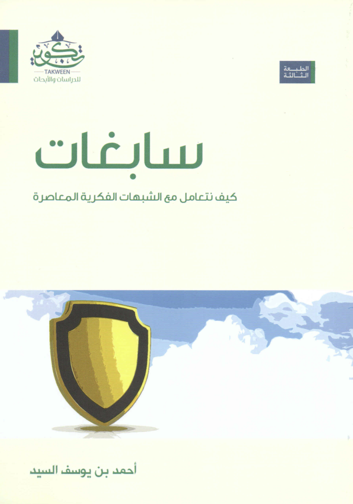

หนังสือเล่มนี้ ได้ชื่อมาจากคำศัพท์คำหนึ่งที่ถูกกล่าวเอาไว้ในอัลกุรอานนั่นคือ ซาบิฆอต (سَابِغَات) ครั้นที่อัลลอฮ์ตะอาลาได้สั่งท่านนบีดาวูด อะอัยฮิสลาม ว่า

أَنِ اعْمَلْ سَابِغَاتٍ وَقَدِّرْ فِي السَّرْدِ ۖ وَاعْمَلُوا صَالِحًا ۖ إِنِّي بِمَا تَعْمَلُونَ بَصِيرٌ

"เจ้าจงทำเสื้อเกราะและทำห่วงของมันให้ได้สัดส่วน และพวกเจ้าจงทำความดีเถิดแท้จริง ข้านั้นรู้เห็นสิ่งที่พวกเจ้ากระทำ" (อัสสะบะอ์ อายะฮ์ที่ 11)

โดยที่ชุดเกราะในยุคนั้นประกอบไปด้วยห่วง ที่เชื่อมต่อกันด้วยการตอกตะปู อัลลอฮ์ได้ทรงสั่งให้ท่านนบีดาวูด อะลัยฮิสลาม สร้างชุดเกราะด้วยความละเอียดปราณีต ขนาดใหญ่เพียงพอและครอบคลุมทุกส่วน และตอกตะปูระหว่างห่วงแต่ละห่วงให้ตรงและได้สัดส่วน ทางด้านภาษาคำว่า ซาบิฆอต (سَابِغَات) สื่อที่สิ่งที่ยาว สมบูรณ์ ฉะนั้นซาบิฆอตคือเสื้อเกราะที่ยาวและสมบูรณ์ สามารถปกป้องสิ่งสำคัญ

<!--truncate-->

[Click ดาวน์โหลดหนังสือต้นฉบับภาษาอาหรับ](./sabighat_arabic.pdf)

[Click ดาวน์โหลดหนังสือฉบับแปลภาษาอังกฤษ](./sabighat_english.pdf)

หนังสือเล่มนี้ประกอบไปด้วยหัวข้อใหญ่ 5 หัวข้อ ดังนี้

## 1. ลักษณะเด่นของสิ่งที่เป็นเหตุสร้างความคลุมเครือในยุคร่วมสมัย สัญลักษณ์ และธรรมชาติการได้รับผลกระทบจากมัน

## 2. สาเหตุต่าง ๆ ของการได้รับผลกระทบทางลบจากสิ่งที่สร้างความคลุมเครือในยุคร่วมสมัย

## 3. เราจะรับมือกับข้อคลุมเครือทางแนวคิดร่วมสมัยอย่างไร

บทนี้ถูกถึงหลักสามประการในการเผชิญกับข้อคลุมเครือทางแนวคิดร่วมสมัย ได้แก่

  1. กฎเกณฑ์ในการป้องกันข้อคลุมเครือทางแนวคิดร่วมสมัย
  
  เช่น การเสริมสร้างความมั่นใจเกี่ยวกับรากฐานของอิสลาม ในหัวข้อนี้ผู้เขียนได้มีการแนะนำหนังสืออีกหลาย ๆ เล่ม ที่สร้างความมั่นใจถึงสัจธรรมของอิสลาม เช่น
  - อันนะบะอฺ อัลอะซีม โดยมุฮัมมัด อับดุลลอฮ์ อัดดิรอส
  - บะรอฮีน วะอะดิลละฮ์อีมานียะฮ์ โดย อับดุรเราะฮ์มาน ฮะซัน ฮะบันกะฮ์ อัลมัยดานีย์
  - นุบูวะฮ์ มุฮัมมัด มินัชชักก์ อิลัลยะกีน โดย ฟาฎิล อัซซามิรออีย์
  - อัลอะดิลละฮ์ อัลอักลียะฮ์ อันนักลียะฮ์ อะลา อุศูล อัลอิอ์ติกอด โดยสะอูด อัลอุร็อยฟีย์
  - [กามิลุซซูเราะฮ์ เล่ม 2](./kamel_soura.pdf) โดย อะหมัด บินยูซุฟ อัซซัยยิต (ซึ่งก็คือผู้เขียนซาบิฆอตเอง)

  2. กฎเกณฑ์ในการรับมือกับข้อคลุมเครือหลังจากที่มันได้เกิดขึ้น
  3. กฎเกณฑ์ในการถกเถียง และทักษะในการโต้แย้งเพื่อวิภาษพวกสร้างความคลุมเครือ

## 4. วิภาษข้อคลุมเครือทางแนวคิดร่วมสมัยหลัก ๆ ที่พวกเอทิสต์ พวกไม่มีศาสนา และพวกที่ปฏิเสธซุนนะฮ์ ได้เผยแพร่

## 5. สรุปเรื่องต่าง ๆ ทางความคิดที่สำคัญ
